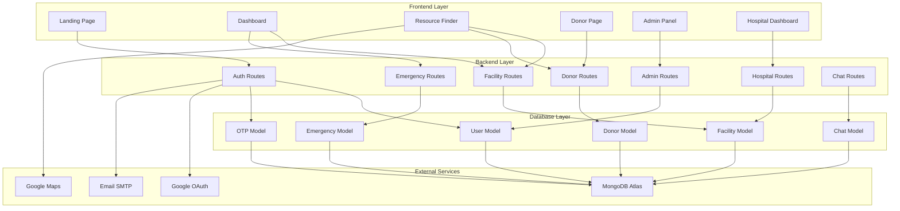
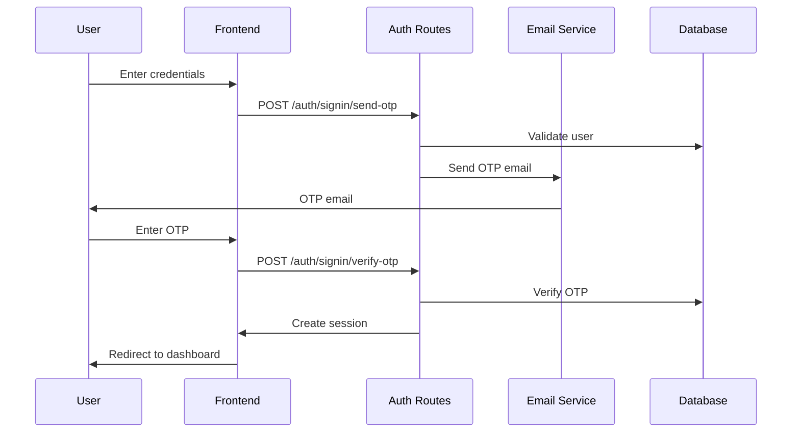
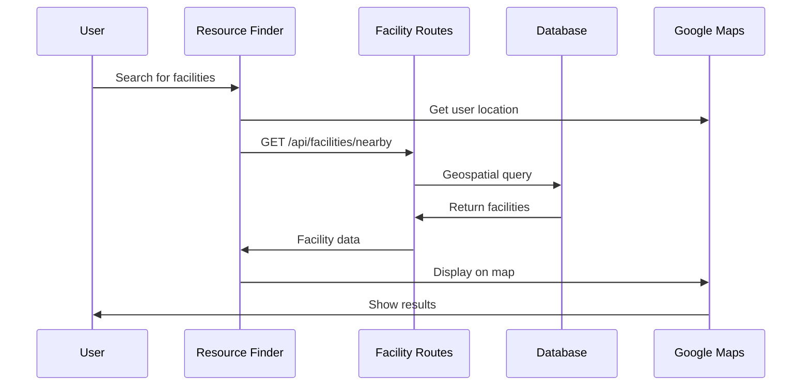

# EMResource Architecture Diagram

## System Overview

```mermaid
graph TB
    subgraph "Frontend Layer"
        LP[Landing Page]
        DB[Dashboard]
        RF[Resource Finder]
        DP[Donor Page]
        AP[Admin Panel]
        HP[Hospital Dashboard]
    end
    
    subgraph "Backend Layer"
        AR[Auth Routes]
        FR[Facility Routes]
        DR[Donor Routes]
        ER[Emergency Routes]
        ADR[Admin Routes]
        HR[Hospital Routes]
        CR[Chat Routes]
    end
    
    subgraph "Database Layer"
        UM[User Model]
        FM[Facility Model]
        DOM[Donor Model]
        EM[Emergency Model]
        CM[Chat Model]
        OM[OTP Model]
    end
    
    subgraph "External Services"
        MA[MongoDB Atlas]
        GM[Google Maps]
        GO[Google OAuth]
        ES[Email SMTP]
    end
    
    LP --> AR
    DB --> FR
    DB --> ER
    RF --> FR
    RF --> DR
    DP --> DR
    AP --> ADR
    HP --> HR
    
    AR --> UM
    AR --> OM
    FR --> FM
    DR --> DOM
    ER --> EM
    CR --> CM
    ADR --> UM
    HR --> FM
    
    UM --> MA
    FM --> MA
    DOM --> MA
    EM --> MA
    CM --> MA
    OM --> MA
    
    AR --> GO
    AR --> ES
    RF --> GM
```

## Authentication Flow

```mermaid
sequenceDiagram
    participant U as User
    participant F as Frontend
    participant A as Auth Routes
    participant E as Email Service
    participant D as Database
    
    U->>F: Enter credentials
    F->>A: POST /auth/signin/send-otp
    A->>D: Validate user
    A->>E: Send OTP email
    E->>U: OTP email
    U->>F: Enter OTP
    F->>A: POST /auth/signin/verify-otp
    A->>D: Verify OTP
    A->>F: Create session
    F->>U: Redirect to dashboard
```

## Resource Discovery Flow

```mermaid
sequenceDiagram
    participant U as User
    participant R as Resource Finder
    participant F as Facility Routes
    participant D as Database
    participant G as Google Maps
    
    U->>R: Search for facilities
    R->>G: Get user location
    R->>F: GET /api/facilities/nearby
    F->>D: Geospatial query
    D->>F: Return facilities
    F->>R: Facility data
    R->>G: Display on map
    G->>U: Show results
```
